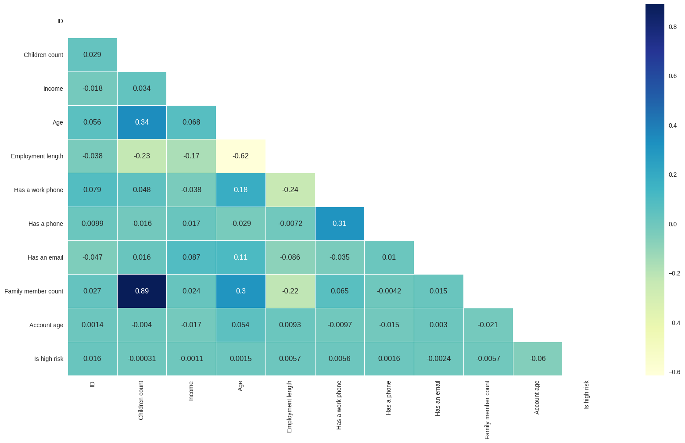

# Phân tích khả năng tín dụng của khách hàng
## Tổng quan dự án
Dự án nhằm phân tích dữ liệu từ khách hàng và giúp người dùng đưa ra quyết định có được chấp nhận một khoản vay hay không.

## Yêu cầu
- Python 3.10
- Streamlit 
## Cài đặt

1. Khởi tạo môi trường ảo  
Conda environment  
`conda create -n <env_name> python=3.10`  

2. Activate môi trường  
`conda activate <env_name>` 

3. Cài đặt package  
`python -m pip install -r requirements.txt`

## Phương pháp sử dụng  
- Exploratory data analysis
- Bivariate analysis
- Multivariate correlation
- Model deployment

## Data Source
[Kaggle Credit Card Approval Prediction ](https://www.kaggle.com/datasets/rikdifos/credit-card-approval-prediction)

## Tổng quan về kết quả

### Ma trận tương quan

